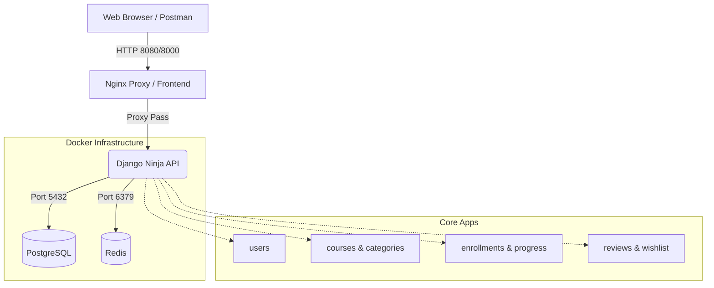

# Simple LMS API

Simple LMS API adalah platform backend Learning Management System komprehensif yang dibangun menggunakan Django Ninja. Proyek ini diimplementasikan untuk memenuhi tugas mata kuliah Sistem Skala Skala VR (SSVR).

API ini menawarkan fitur-fitur lengkap untuk tiga peran berbeda (Admin, Instructor, Student) dengan kemampuan kurikulum (Section & Lesson), progres belajar (Percentage & Completion), dashboard analitik, pendaftaran (enrollment), ulasan (review), dan daftar keinginan (wishlist).

---

## Fitur Utama (Paket 1 - LMS Experience)

- **Search, Filter, dan Sorting Lanjutan**: Pencarian kursus berdasarkan teks, kategori, instruktur, level (beginner/intermediate/advanced), status, dan pengurutan (populer, terbaru, dsb).
- **Curriculum & Progress Detail**: Kursus memiliki hierarki Section dan Lesson. Progres mahasiswa dihitung secara real-time dalam persentase (%).
- **Rating, Review, dan Wishlist**: Mahasiswa dapat menyimpan kursus favorit (wishlist) dan memberikan rating (1-5 bintang) serta ulasan pada kursus yang telah mereka ikuti.
- **Student Dashboard**: Ringkasan kursus yang aktif, kursus yang sudah selesai, pelajaran terakhir yang dibuka, dan rekomendasi kursus terbaik.
- **Keamanan Kuat**: Autentikasi berbasis JWT (JSON Web Tokens), validasi kepemilikan data (RBAC - Role Based Access Control), dan perlindungan konfigurasi sensitif (Fail-Fast env vars).

---

## Prasyarat (Prerequisites)

Sistem ini didesain sepenuhnya menggunakan arsitektur containerized. Anda hanya memerlukan dua komponen untuk menjalankan aplikasi ini:
1. Docker
2. Docker Compose

*(Tidak perlu menginstal Python atau PostgreSQL secara manual di komputer Anda).*

### Diagram Arsitektur Sistem


---

## Instalasi dan Cara Menjalankan

Ikuti langkah-langkah berikut untuk menjalankan sistem secara lokal dari awal:

**1. Clone Repository Git**
Pertama, salin repository kode ke komputer Anda dan masuk ke dalam folder proyek:
```bash
git https://github.com/DFNexus/UAS_SSVR.git
cd UAS-SSVR
```

**2. Konfigurasi Environment Variables**
Aplikasi ini sangat ketat dalam keamanan dan memerlukan file `.env` agar dapat berjalan. 
Buatlah sebuah file bernama `.env` di direktori utama (sejajar dengan file `docker-compose.yml`), lalu isi dengan konfigurasi berikut:
```env
DJANGO_SECRET_KEY=ganti-dengan-kunci-rahasia-kamu
DJANGO_DEBUG=True
DJANGO_ALLOWED_HOSTS=*

DB_NAME=lms_db
DB_USER=postgres
DB_PASSWORD=postgres
DB_HOST=db
DB_PORT=5432

REDIS_URL=redis://redis:6379/1

JWT_ACCESS_TOKEN_LIFETIME_MINUTES=60
JWT_REFRESH_TOKEN_LIFETIME_DAYS=7
```
*(Catatan: Jangan pernah membagikan nilai `DJANGO_SECRET_KEY` atau `DB_PASSWORD` Anda jika aplikasi ini di-deploy ke production).*

**3. Jalankan Aplikasi dengan Docker Compose**
Jalankan perintah berikut untuk mengunduh dan menyalakan semua sistem (Database, Cache, dan Web API) di latar belakang:
```bash
docker compose up -d --build
```
*(Proses ini akan mengunduh image PostgreSQL, Redis, mem-build aplikasi Django, dan menjalankan semua migrasi tabel database secara otomatis. Harap tunggu beberapa saat hingga container berstatus "Started" atau "Healthy").untuk pertama kali kalian bisa menggunakan perintah --build dahulu baru setelahnya bisa langsung docker compose up -d*

**4. Inisialisasi Data Demo (Seeding)**
Untuk mempermudah pengujian, sistem menyediakan script khusus untuk mengisi database dengan data awal (kategori, pengguna, kursus, dan ulasan). Jalankan perintah ini:
```bash
docker compose exec web python manage.py seed_demo_data
```

**5. Aplikasi Siap Digunakan**
Aplikasi kini berjalan dan dapat diakses di:
- **Swagger / API Docs**: http://localhost:8000/api/docs
- **Django Admin**: http://localhost:8000/admin/

*(Untuk mematikan server, jalankan perintah: `docker compose down`)*

---

## Akun Demo Terdaftar

Setelah Anda menjalankan perintah seeding di atas, Anda dapat masuk (login) menggunakan akun berikut:

| Role | Username | Password | Deskripsi / Fungsi Utama |
|:---|:---|:---|:---|
| **Admin** | `admin` | `admin123` | Akses ke seluruh endpoint tanpa batasan, manajemen kategori. |
| **Instructor** | `instructor1` | `instructor123` | Bisa membuat, mengubah, menghapus kursusnya sendiri, dan melihat enrollment muridnya. |
| **Instructor** | `instructor2` | `instructor123` | Sama dengan Instructor 1 (untuk menguji data isolation). |
| **Student** | `student1` | `student123` | Bisa mendaftar (enroll), progres belajar, review, wishlist, dan melihat dashboard. |
| **Student** | `student2` | `student123` | Sama dengan Student 1. |

*Untuk login, kirim `POST /api/auth/login` dan ambil access token. Di Swagger, klik tombol Authorize, ketik `Bearer ` diikuti dengan spasi dan paste token Anda.*

---

## Daftar Endpoint Utama

Semua URL diawali dengan `http://localhost:8000/api`. Lihat Swagger UI untuk dokumentasi JSON skema dan Request/Response interaktif.

| Grup | Method | Endpoint | Deskripsi |
|:---|:---:|:---|:---|
| **Auth** | `POST` | `/auth/login` | Mendapatkan Access dan Refresh token. |
| **Auth** | `GET` | `/auth/me` | Melihat profil user yang sedang login. |
| **Categories**| `GET` | `/categories/` | Melihat daftar kategori. |
| **Courses** | `GET` | `/courses/` | Mencari dan filter seluruh kursus. |
| **Courses** | `GET` | `/courses/{id}` | Melihat detail kursus (termasuk curriculum & rating). |
| **Courses** | `POST` | `/courses/` | *(Instructor/Admin)* Membuat kursus baru. |
| **Enrollment**| `POST` | `/enrollments/` | *(Student)* Mendaftar ke sebuah kursus. |
| **Progress** | `POST` | `/lessons/{id}/complete` | *(Student)* Menandai materi selesai dipelajari. |
| **Progress** | `GET` | `/courses/{id}/progress` | *(Student)* Melihat persentase penyelesaian kursus. |
| **Reviews** | `POST` | `/courses/{id}/reviews` | *(Student)* Memberikan rating (1-5) dan teks ulasan. |
| **Wishlist** | `POST` | `/wishlist/` | *(Student)* Menambah kursus ke daftar keinginan. |
| **Dashboard** | `GET` | `/dashboard/student` | *(Student)* Melihat kursus aktif, selesai, dan rekomendasi. |

---

## Testing (Pengujian Otomatis)

Sistem ini didukung oleh Automated Unit Testing yang komprehensif menggunakan pytest dan pytest-django, mencakup sistem Role-Based Access Control, filter pencarian, dan seluruh logic utama. 

Untuk menjalankan pengujian dan melihat Code Coverage:

```bash
docker compose exec web pytest
```

---

## Pengujian Manual via Postman

Terdapat file Postman Collection di dalam folder `postman/` (`UAS-SSVR-Collection.json`).
- Impor file JSON tersebut ke aplikasi Postman.
- File tersebut sudah mencakup environment variables (seperti `{{base_url}}`).
- Anda bisa langsung mencoba endpoint dengan token yang dapat diatur via tab Variables di level Collection.
